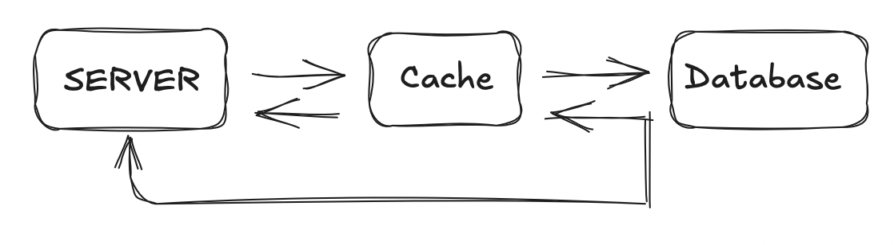
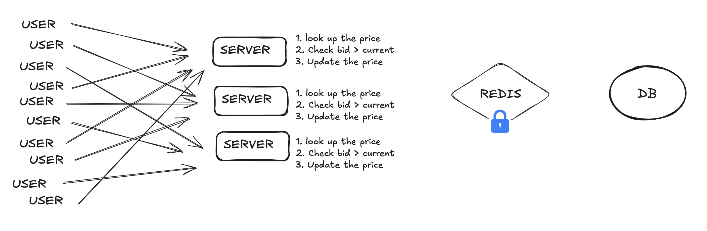
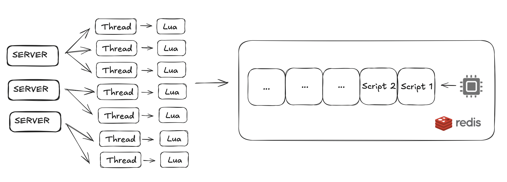
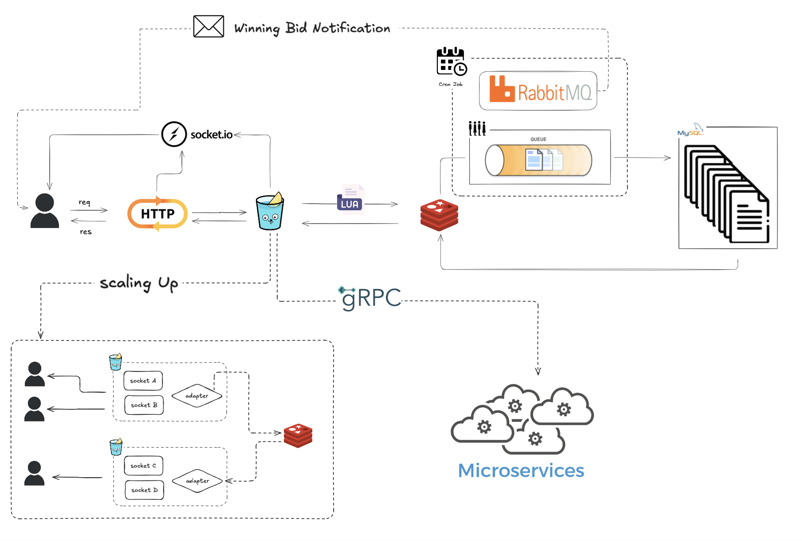

# Mini-Auction 1.0.0

## Description

> 今天要在分散式系統中實現一個限時競標拍賣功能，需顯示最新價格、下標更新以及最終的成交，請使用 Golang 撰寫一個簡單的範例，重點考慮下標時可能出現的競爭（Race Condition）情境

## Prerequisite

- Redis (redis_version:7.2.1)
- go (1.20)

## Quick Start

\*\*\* 請在 ./mini-auction 中運行 `redis-server` <br>
\*\*\* 若啟動 redis 無自動加載 dump.rdb，需手動還原

```shell
$ git clone https://github.com/huanciou/mini-auction.git
$ cd ./mini-auction
$ redis-server
$ go mod tidy
$ go run main.go
```

## Routes

### Auction Bids

- URL: http://localhost:3000/auction
- Description: Auction Bids

## Schema

### Products

| Parameter | Type      |
| --------- | --------- |
| Id        | int       |
| Name      | int       |
| Pirce     | int       |
| Bidder    | string    |
| startAt   | date.Date |
| endAt     | date.Date |

## Overview


當遇到高流量時，DB 會面臨 I/O 瓶頸，面臨功能失效



利用 Cache 來將當前正在拍賣的商品緩存，這時候可以解決大幅度對資料庫的 I/O 問題
但是又遇到下一個問題：當多個用戶併發對一個商品出價時，有可能出現 Race Condition
造成 Bid Overwriting 問題



遇到 Race Condition，我可以下手的地方有兩個

1. 在 RDB 當中對單個競標的過程作 Transaction
2. 在 Cache 當中對單個競標的過程上鎖

然而第一個看起來不太可行，原因是我們已經希望商品在競標的期間是拉到快取上作存取，因為
如果每一筆競標還需要在 DB 中進行效率太慢了。

而第二項，在 redis 中可以利用：

1. `SETNX` 來實現樂觀鎖
2. 或利用 `WATCH/Multi` 來實現悲觀鎖

而在這個應用中兩者會遇到的問題在於：前者在高併發下無法完全保證每筆交易的原子性，後者在高併發下
容易因為阻塞造成效率的下降，並且當邏輯逐漸複雜時，有可能造成死鎖



因此我們想要做到的事情是，既能夠保證每一筆競價的原子性，又能夠維持高效率，於是就可以利用
Lua 這個腳本來替我們完成。

Redis 的 Docs 中 Atomicity with Lua 提到：

> Redis has the ability to execute Lua scripts on the server side. Lua scripts are executed atomically, that is, no other script or command will run while a script is running, which gives us the same transactional semantics as MULTI / EXEC.

當我們把競標的邏輯寫在 Lua 中，便可以確保 Redis 在執行一筆競價中保持原子性，並且因為 Redis
是 in-memory i/o 所以可以確保它的高效率

## Architecture

\*\*\* 尚未實作所有功能



- 利用 Socket.io 使 Client 與 Server 建立持久連線，旨在即時更新競標價格，
  當出現最高競標價格時，利用廣播的方式傳送給所有建立持久連線的用戶。

- 利用 Lua 來操作 Redis，確保單個競標的原子性

  - 再啟動伺服器端時會運行 `utils.LoadScripts()`，並且直接把腳本 Hash
    用意在減少重新解析腳本的動作，加快速度

- Cron Job 有兩個主要任務：

  - 將商品存入快取。可以設計每日更新一次
    如此當日(可視業務邏輯改變)只需要 db 只需要 query 一次、update 一次
    這邊商品用 HSET 的方式存在 Redis 中

  1. 將 redis 中 `endAt` 競標到期的商品存入 queue。每日 0 點存入 db
  2. 將 db 中 `startAt` 開始競標的商品，存入 redis 當中。每日 0 點從 db 取出

  - RabbitMQ

  1. 當商品競標結束的時候，寄送網站郵件給用戶告知得標

- 當 server 水平擴展時，需要在伺服器端多加入 socket.io adpater，並且用 redis
  Pub/Sub 功能來同步所有 event emissions

- 當服務擴展，將 競標/運算/隊列處理/交易 ... 等功能拆開，在服務器之間的溝通可以
  利用 gRPC 進行，由於是模擬會有高流量需求，處理效率就很重要， gRPC 傳輸之間
  是利用 binary file，會比傳 JSON 來的更快
